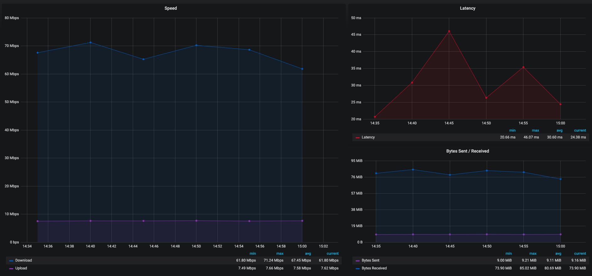

# speed-test-isp-cdk

A cdk stack for ingesting internet connection speed metrics into cloud watch. The stack is intended to be used with the data generated by [speed-test-isp.py](https://github.com/mitchmckenzie/speed-test-isp/blob/master/speed-test-isp.py).
 
The following resources are generated when the cdk stack is deployed:

1. API Gateway - A REST end-point to post connection speed data to as JSON. 
2. Lambda - Receives connection speed data and persists the data as custom metrics in cloud watch.

###Visualizing Metrics

Cloud Watch provides visualizations for the metrics but Grafana is a better visualization tool IMO and has a free cloud watch data source that comes with it :

https://grafana.com/docs/grafana/latest/features/datasources/cloudwatch/

## Install Instructions

These instructions assume you have a basic understanding of aws and also have experience calling aws apis using some kind of command line interface tool like the aws cli.
If you are new to cdk, please be sure to read through the [cdk documentation](https://docs.aws.amazon.com/cdk/latest/guide/getting_started.html) before continuing with this install.

### CDK Bootstraping

This stack requires deploying a lambda so you must first bootstrap your account:

```
cdk bootstrap aws://[YOUR-AWS-ACCOUNT-NUMBER]/[YOUR-DESIRED-REGION]
```
Example: 
```
cdk bootstrap aws://1234567890/us-east-1
```
### Deployment

To deploy the stack run :
 
```
cdk deploy
```

When the deployment is complete you should see your end-point in the stdout:

```
SpeedTestIspCdkStack: creating CloudFormation changeset...

 ✅  SpeedTestIspCdkStack

Outputs:
SpeedTestIspCdkStack.speedtestispEndpointABC123 = https://[your-api-gateway-id].execute-api.us-east-1.amazonaws.com/prod/
```

The full path to where metrics are posted to is :

```
POST : https://[your-api-gateway-id].execute-api.us-east-1.amazonaws.com/prod/v1/save-results
```
Login to your aws console to locate and reveal the api key that needs to be passed with the POST request using the http header : x-api-key

Here is an example payload:
 
 ```json
{
  "download": 64023307.95232275,
  "upload": 7845106.88537867,
  "ping": 45.277,
  "server": {
    "url": "http://speedtest.rd.om.cox.net:8080/speedtest/upload.php",
    "lat": "41.2500",
    "lon": "-96.0000",
    "name": "Omaha, NE",
    "country": "United States",
    "cc": "US",
    "sponsor": "Cox - Omaha",
    "id": "16621",
    "host": "speedtest.rd.om.cox.net:8080",
    "d": 13.092320718374381,
    "latency": 45.277
  },
  "timestamp": "2020-04-05T19:16:33.586911Z",
  "bytes_sent": 10182656,
  "bytes_received": 80075116,
  "share": null,
  "client": {
    "ip": "123.123.123.123",
    "lat": "41.2854",
    "lon": "-96.1494",
    "isp": "Cox Communications",
    "isprating": "3.7",
    "rating": "0",
    "ispdlavg": "0",
    "ispulavg": "0",
    "loggedin": "0",
    "country": "US",
    "customer_name": "Joe Exotic"
  }
}
```

## Visualizing Metrics

Cloud Watch provides visualizations for the metrics but Grafana is a better visualization tool IMO and has a free cloud watch data source that comes with it :

#### Example Dashboard :

